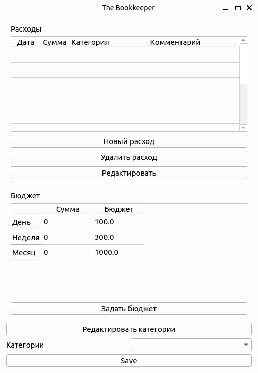
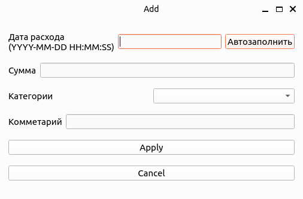
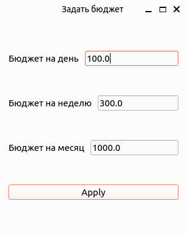
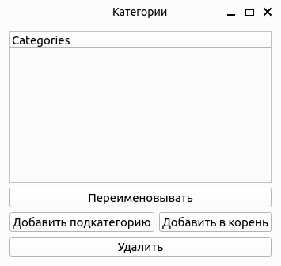

# Программа для управления личными финансами
#### (учебный проект для курса по практике программирования на Python)

[Техническое задание](specification.md)

Прежде чем приступать к разработке проекта, определитесь, как вы будете работать с данными. Допускаются следующие варианты:

1. непосредственное обращение к БД SQLite через библиотеку `sqlite3` с написанием SQL-запросов;
1. использование библиотеки ORM (PonyORM, SQLAlchemy);
1. разработка собственного механизма для взаимодействия с БД в соответствии с паттерном «репозиторий».

Здесь приведены примеры кода для ознакомления с третьим вариантом работы с БД. Рекомендуем опробовать этот код на своем компьютере и затем выбрать подход, который подходит вам. 

Также в этой заготовке кода задана предпочтительная структура файлов и каталогов (модулей и пакетов), которая отражает архитектуру проекта:

📁 bookkeeper — исполняемый код 

- 📁 models — модели данных

    - 📄 budget.py — бюджет
    - 📄 category.py — категория расходов
    - 📄 expense.py — расходная операция
- 📁 presenter - модуль для взаимодействия с пользователем
    - 📄 presenter.py - файл реализации приложения
- 📁 repository — репозиторий для хранения данных

    - 📄 abstract_repository.py — описание интерфейса
    - 📄 memory_repository.py — репозиторий для хранения в оперативной памяти
    - 📄 sqlite_repository.py — репозиторий для хранения в sqlite 
- 📁 view — графический интерфейс
   
    - 📄 budget_view.py - виджет бюджета в главном окне
    - 📄 category_dialogs.py - диалоги для изменения категорий
    - 📄 category_window.py - Окно списка категорий
    - 📄 change_expense_dialog.py - Диалог для изменения или добавления расхода
    - 📄 expense_view.py - виджет расходов в главном окне
    - 📄 set_budget_dialog.py - диалог для задания таблицы бюджета
- 📄 simple_client.py — простая консольная утилита, позволяющая посмотреть на работу программы в действии
- 📄 utils.py — вспомогательные функции

📁 tests — тесты (структура каталога дублирует структуру bookkeeper)

📁 images - Изображения виджета приложения

📁 htmlcov - Тесты с pytest
- 📄 index.html - Отчет о тестировании

Для работы с проектом склонируйте этот код через `git` на свой компьютер. Все комментарии об особенностях своей разработки пишите в файл `README.md`.

Проект создан с помощью `poetry`. Убедитесь, что система `poetry` у вас установлена. Инструкцию по установке можно посмотреть [здесь](https://python-poetry.org/docs/).

Если возникли проблемы с `poetry`, можно создать виртуальное окружение через `virtualenv` и установить необходимые зависимости через `pip`.

Для запуска приложения в консоли выполните команду (убедитесь, что вы находитесь
в корневой папке проекта — там, где лежит файл pyproject.toml):
```commandline
python3 bookkeeper/presenter/presenter.py
```
Главное окно приложения выглядит так:



Кнопки в главном окне

- `Новый расход` - открывает диалог для добавления нового расхода в таблицу расходов
- `Удалить расход` - удаление расхода из таблицы
- `Редактировать расход` - открывает диалог для редактирования выбранного расхода
- `Задать бюджет` - открывает диалог для задания (и изменения) таблицы бюджета
- `Редактировать категории` - открывать новое окно для редактирования категорий
- `Save` - Сохранение данных в базу

Диалог для добавления нового расхода или редактирования расхода:



Диалог для задания бюджета:



Окно для редактирования категорий:



Кнопки в окне `Категории`

- `Переименовать` - переименование выбранной категории
- `Добавить подкатегорию` - добавление новой дочерной категории
- `Добавить в корень` - добавление новой категории самого первого уровня
- `Удалить` - удаление выбранной категории

Можно отображать отдельные окна виджетов для каждой таблицы (без сохранения данных)
```commandline
python3 bookkeeper/view/budget_view.py
python3 bookkeeper/view/expense_view.py
python3 bookkeeper/view/category_window.py
```

Для установки всех зависимостей через `poetry` запустите следующую команду (убедитесь, что вы находитесь
в корневой папке проекта — там, где лежит файл pyproject.toml):

```commandline
poetry install
```

Для запуска тестов и статических анализаторов используйте следующие команды (убедитесь, 
что вы находитесь в корневой папке проекта):
```commandline
poetry run pytest --cov
poetry run mypy --strict bookkeeper
poetry run pylint bookkeeper
poetry run flake8 bookkeeper
```

